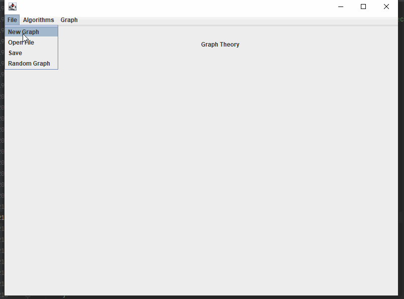
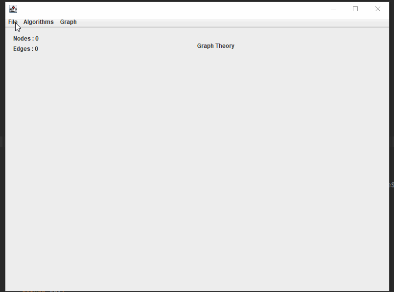
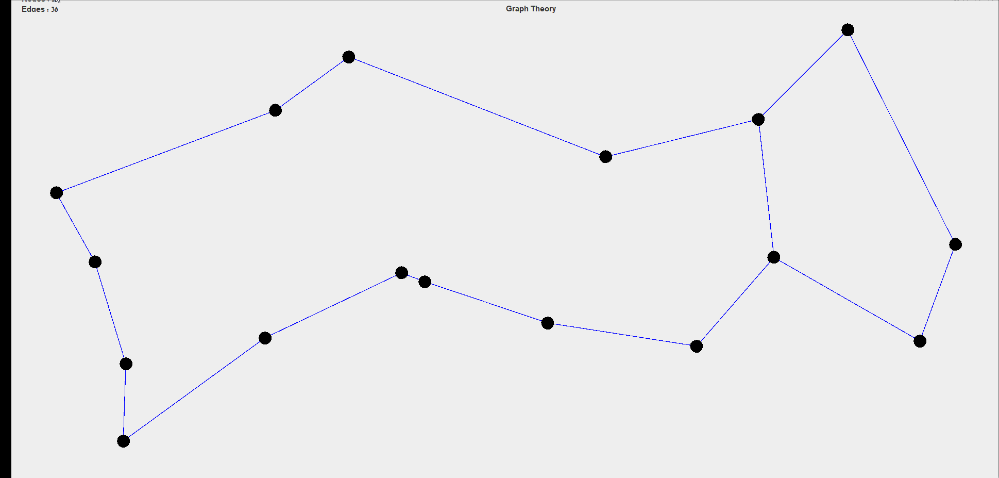

# Graph Theory

#### A part of a university assignment

 

## Project Overview
Implementing weighted graph data structure alongside some known graph algorithms 
and a simple GUI with JFrame

 

## How To Run

`From the terminal : `

    java -jar .\Ex2.jar G1.json

 

## How To Use The GUI

- `Add Node` click anywhere on the canvase and enter a node key or `Graph -> Add Node`
- `Remove Node :` `Graph -> Remove Node` then enter node key
- `Add Edge :` drag and drop form two different nodes or `Graph -> Add Edge`
- `Remove Edge :` drag and drop form two different nodes or `Graph -> Remove Edge`
-  To excute an algorithm `Algorithms -> `
- `Save graph :` `File -> Save` saves the graph as json
- `Open :` `File -> Open File` opens json graph file
- `New Graph :` `File -> New Graph` creates an empty graph
- `Random Graph :` `File -> Random Graph` creates a random graph

 
 

### Examples 
 

    Adding Nodes & Edges & Is Connceted Algorithm

 

    Random Graph

 

## What has been done ?

- ### Graph 

    - Add node
    - Delete node
    - Add edge 
    - Delete edge
    - iterate through all the nodes 
    - iterate through all the edges 

  
- ### Algorithms 

    - Shortest path between two nodes 
    - The center node
    - Travelling salesman problem
    - Strongly connected

- ### Json 
   
    - Load json graph
    - Save graph as json

 

## Algorithms Implementation 

- `Dijkstra Algorithm` for the shortest path between two nodes O(|V|*|V|)  
- `Strongly connected components` to check weither the graph
is connected there must be only **One** strongly connected component O(|V|+|E|)
- `center` algorithm using the shortest path O(|V| * |V| * |V|)

 

# Example 
    Running the shortest path algorithm "Dijkstra Algorithm"  
 

  

 

# Running Times

- Graph with 1000 nodes 20 edges
  
  - shortest path : 3ms 
  - is connected : 4ms
  - center : 4ms

- Graph with 10000 nodes 20 edges

  - shortest path : 7ms
  - is connected : 22ms
  - center : 17ms
  

- Graph with 100000 nodes 20 edges

  - shortest path : 53ms
  - is connected : 513ms
  - center : 514ms

- Graph with 1000000 nodes 20 edges

  - shortest path : *
  - is connected : *
  - center : *

 

## Authors

* **Tarik Husin**  - linkedin -> https://www.linkedin.com/in/tarik-husin-706754184/
* **Wisam Kabha**  - github -> https://github.com/Wissam111

 

## References

https://en.wikipedia.org/wiki/Graph_center

https://en.wikipedia.org/wiki/Travelling_salesman_problem

https://www.youtube.com/watch?v=XB4MIexjvY0&t=484s

https://www.youtube.com/watch?v=XaXsJJh-Q5Y&t=600s